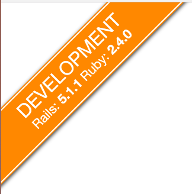
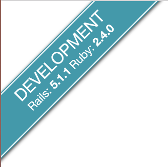
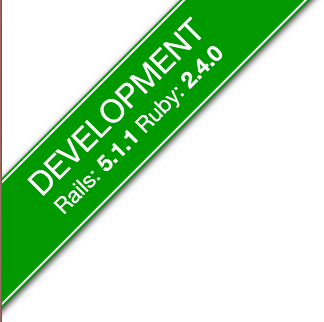
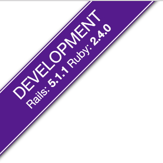
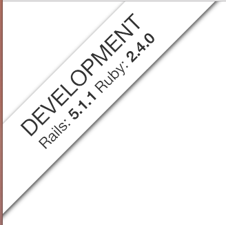
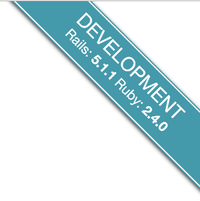
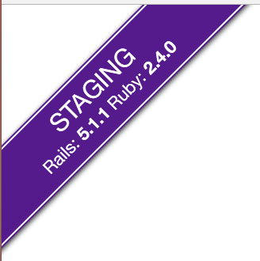

# Ribbonit

**Ribbonit** displays an elegant ribbon to the corner of the page displaying useful information about the application: **Rails environment**, **Rails version**, **Ruby version**.

It is completely inspired from the Github 'fork me' ribbon.

[](https://rubygems.org/gems/ribbonit)


## Installation

Add this line to your application's Gemfile:

```ruby
# Gemfile
gem 'ribbonit'
```

And then execute:

```shell
$ bundle
```

Or install it yourself as:
```shell
$ gem install ribbonit
```

## Usage

1) Run initializer
```shell
$ bin/rails g ribbonit:install
```
This will create a `ribbonit.rb` file in `config/initializers`

2) Import assets
```sass
// application.sass
@import ribbon
```

3) Call ribbon in layout
```slim
/ application.slim
...
body
  = ribbonit
```

## Options
You can customize some options through the initializer. Here are the defaults options:

```ruby
# config/initializers/ribbonit.rb

display_rails_version = true
display_ruby_version = true

hide_for_small = true # Display ribbon in small devices ?
position = 'top-left' # top-right, bottom-left, bottom-right

# Available colors:
# orange, blue, green, red, purple, black, white
themes = {
  development: 'black',
  staging: 'blue'
}

# Sometimes, people use another name for this environment
staging_name = 'staging'
```

## Screenshots
### Colors
<table>
<tr>
  <td></td>
  <td></td>
  <td></td>
  <td></td>
</tr>
<tr>
  <td>Orange</td>
  <td>Blue</td>
  <td>Green</td>
  <td>Red</td>
</tr>
<tr>
  <td></td>
  <td></td>
  <td></td>
</tr>
<tr>
  <td>Purple</td>
  <td>Black</td>
  <td>White</td>
</tr>
</table>

### Positions
<table>
<tr>
  <td></td>
  <td></td>
  <td></td>
  <td></td>
</tr>
<tr>
  <td>Top/Left</td>
  <td>Top/Right</td>
  <td>Bottom/Right</td>
  <td>Bottom/Left</td>
</tr>
</table>

### Environments
<table>
<tr>
  <td></td>
  <td></td>
</tr>
<tr>
  <td>Development</td>
  <td>Staging</td>
</tr>
</table>

## Contributing
1. Fork it
2. Create your feature branch (`git checkout -b my-new-feature`)
3. Commit your changes (`git commit -am 'Add some feature'`)
4. Push to the branch (`git push origin my-new-feature`)
5. Create new Pull Request
